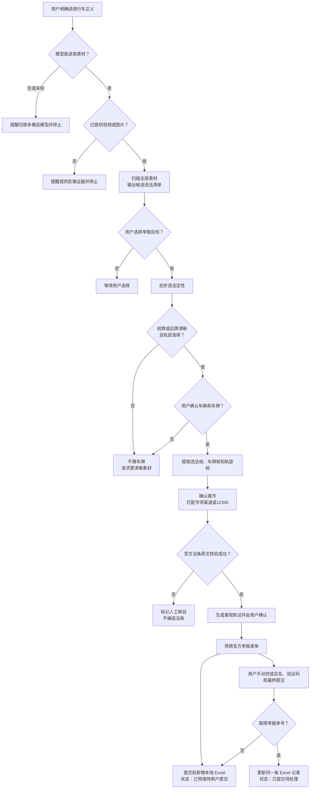

# 行车正义（Driving Justice）

一个面向中国大陆“随手举报交通违法”场景的 Agent Skill：从用户提供的视频或图片中整理候选违法事件，经过人工确认后准备证据、核验法律依据、匹配官方渠道、预填举报材料，并在本地 Excel 中留痕。

> 当前版本：`0.1.0`
>
> 本项目是证据整理与表单预填助手，不构成法律意见。违法行为和证据是否被采纳，以当地公安交管部门的最终认定为准。

## 它能做什么

- 检查当前模型是否真的具备图片或视频理解能力。
- 完整扫描素材，列出所有候选违法瞬间，由用户选择目标。
- 按公开法律对照表初筛违法类型，并在生成陈述前现场核验官方法条。
- 仅在“前牌或后牌至少一面清晰、轨迹连续、用户确认”后使用车牌。
- 匹配当地专项举报渠道；没有专项渠道时再考虑 12345 等通用渠道。
- 预填官方举报表单，但把实名、验证码、真实性承诺和最终提交留给用户。
- 在提交前新增本地 `ledger.xlsx` 记录，提交后再用举报单号更新同一条记录。

## 工作流



这里有两个完全不同的记录面：

1. **官方举报表单**：12345、交警专项网页、App 或小程序，最终提交必须由用户完成。
2. **本地 Excel 台账**：用户自己保存的 `ledger.xlsx`，提交前先新增，提交后更新原记录。

完整输入、输出、判断条件和失败出口以 [SKILL.md](SKILL.md) 及其引用文件为准。

## 安装

需要 Git、Python 3，以及能够读取图片的多模态模型。处理视频时，宿主还必须支持原生视频理解，或者能够在本地抽帧后把图片交给模型。

```bash
git clone https://github.com/foxbitcoo/driving-justice.git
cd driving-justice
python3 -m venv .venv
source .venv/bin/activate
pip install -r requirements.txt
```

然后按照所用 Agent 宿主的本地 Skill 安装方式，将本仓库放入其 Skills 目录。以 Codex 的默认本地目录为例：

```bash
git clone https://github.com/foxbitcoo/driving-justice.git ~/.codex/skills/driving-justice
```

本 Skill 不自动触发。安装后请明确说：

```text
使用“行车正义”分析我提供的这段行车记录仪视频。
```

## 本地 Excel 依赖

```bash
pip install -r requirements.txt
```

台账脚本：

```bash
python scripts/append_ledger.py --entry entry.json --ledger ledger.xlsx
python scripts/update_ledger.py --seq 1 --updates update.json --ledger ledger.xlsx
```

字段说明和示例见 [templates/ledger-schema.md](templates/ledger-schema.md)。

## 不可绕过的边界

- 车牌不清楚就停止，不输出“大概率”车牌。
- 前牌或后牌任意一面可以作为确认依据，但必须能用连续轨迹连接到违法瞬间。
- 禁止生成式修复、补全车牌或车辆细节。
- 城市默认由用户确认，不根据普通画面线索猜测。
- 法条原文必须在生成最终陈述前从官方来源现场核验。
- 实名信息、验证码、真实性承诺和最终提交始终由用户操作。
- 原始视频、关键帧、车牌值和本地 `ledger.xlsx` 不应上传到公共仓库或公开 Issue。

## 当前验证状态

- 自动化测试覆盖本地 Excel 新增、提交后更新、图片嵌入保留、非法字段拒绝和关键流程约束。
- 使用公开视频做过候选识别与失败边界的人工前向检查，记录见 [tests/manual_video_validation.md](tests/manual_video_validation.md)。
- 公开视频检查不包含真实举报提交，也不代表任何官方平台已经受理。
- 完整 Step 0—9 尚未在真实举报素材和真实官方平台上完成端到端验收。

运行本地测试：

```bash
python -m unittest discover -s tests -v
python -m py_compile scripts/append_ledger.py scripts/update_ledger.py
```

## 更新与反馈

GitHub 仓库是本 Skill 的公开最新版来源。更新时进入安装目录执行：

```bash
git pull --ff-only
pip install -r requirements.txt
```

普通问题和可公开复现的坏例可以提交到 [GitHub Issues](https://github.com/foxbitcoo/driving-justice/issues)。不要上传原始交通视频、清晰车牌、人脸、联系方式或其他个人信息；安全问题请先阅读 [SECURITY.md](SECURITY.md)。

## License

[MIT](LICENSE)
